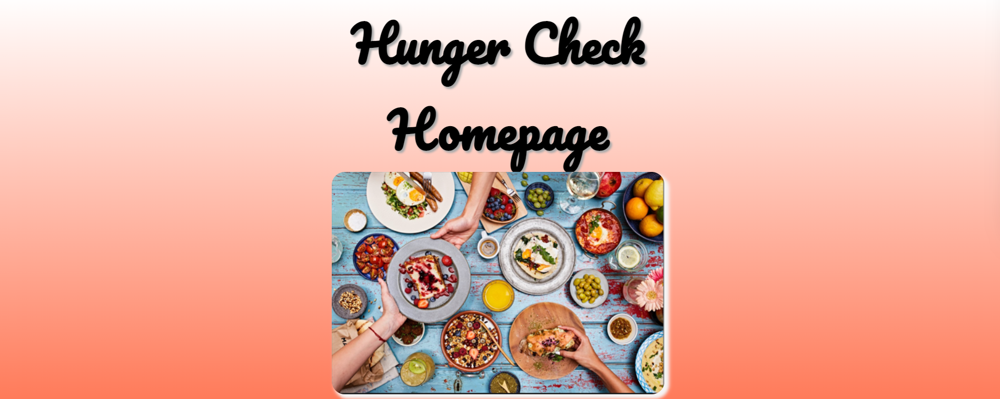
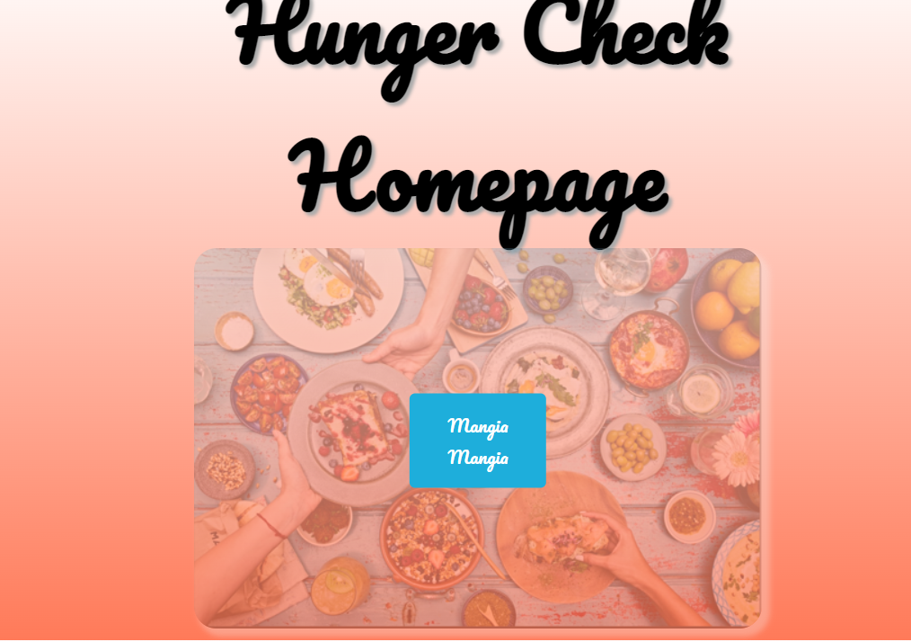
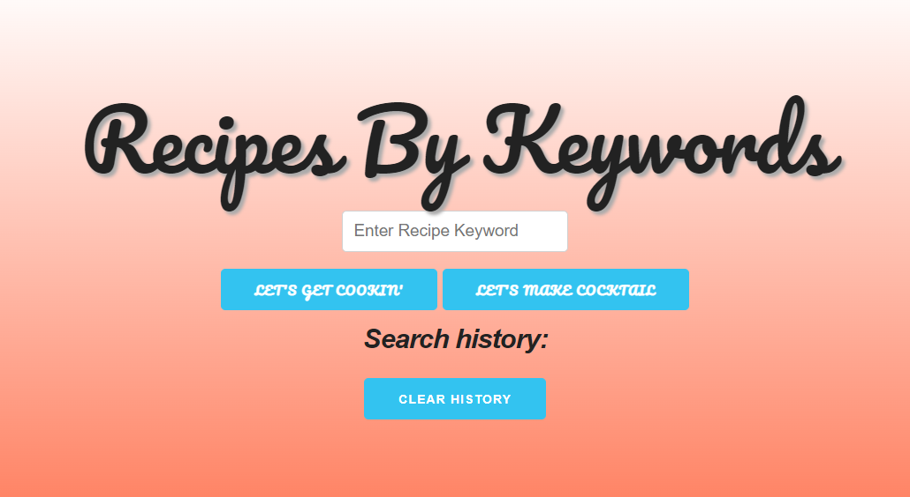
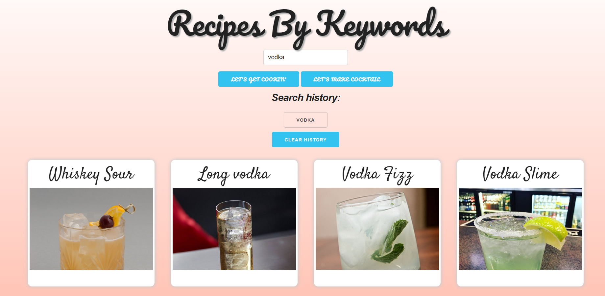
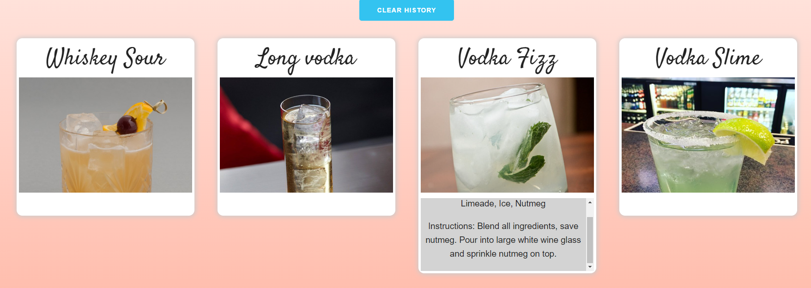
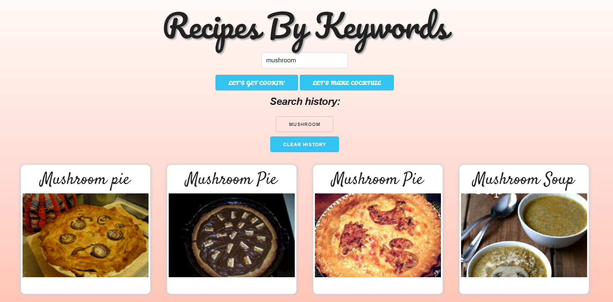

# Recipe_Design_Project

## Project Title
Recipes By Keywords

## Project Description
The objective for this project is to create a UI that will display food recipes based on keywords, 
and will display those keyword specific recipes with ingredients.
As well as have an input for wine pairings.
Should there be no results found the UI will return 0 results rather than closest possible match.

## User Story
AS A foodie I want  
I WANT to be able to search a website using specific keywords
SO THAT recipes specific to those keywords populate with ingredients and instructions

## Acceptance Criteria
GIVEN I am using a UI to search for recipes
WHEN I input a keyword
THEN I presented with a list of options in the form of cards with links to sites with more description on recipes
THEN I am able to view to the ingredients, prep time, and cook time
WHEN I search a cocktail ingredient
THEN I want to see various cocktail options with ingredients and instructions

## APIs to be used
1) https://rapidapi.com/spoonacular/api/recipe-food-nutrition
    https://spoonacular.com/food-api
    https://spoonacular.com/application/frontend/downloads/spoonacular-api-slides.pdf
2) https://rapidapi.com/thecocktaildb/api/the-cocktail-db

## Future Development
1) Search results cards: having only X amount of search history cards generate per keyword or alcohol used.

2) Search History cards: having the buttons repopulate the clicked keyword to the previously displayed cards.

3) Cocktail Cards: links provided similar to food cards where a button will redirect you to a website with further details on cocktail.

## Breakdown of Tasks
Team Lead: Peter, create the repo, add team to repo, create chart task breakdown, coordinate tasks to be done, create presentation slide, creation of html and final edits
Thuy: search for other options aside from bootstrap to use, fetch requests, and javascripting
Kevin: look for modal model structure and come up with layout for page, CSS editing for pages and appended elements

## Table of Contents
Project title, user story, acceptance criteria, APIs to be used, Breakdown of Tasks, Screenshots, Link to presentation slide, Deployed website.

## Screenshots

## Presentation slide links
https://docs.google.com/presentation/d/1kGYBp0mjtDpzuFXpFLQ1J51uw8HvbxmaWoDgpXK8cCA/edit#slide=id.g29f43f0a72_0_5

## Deployed Website
(https://pietroxero.github.io/Recipe_Design_Project/)